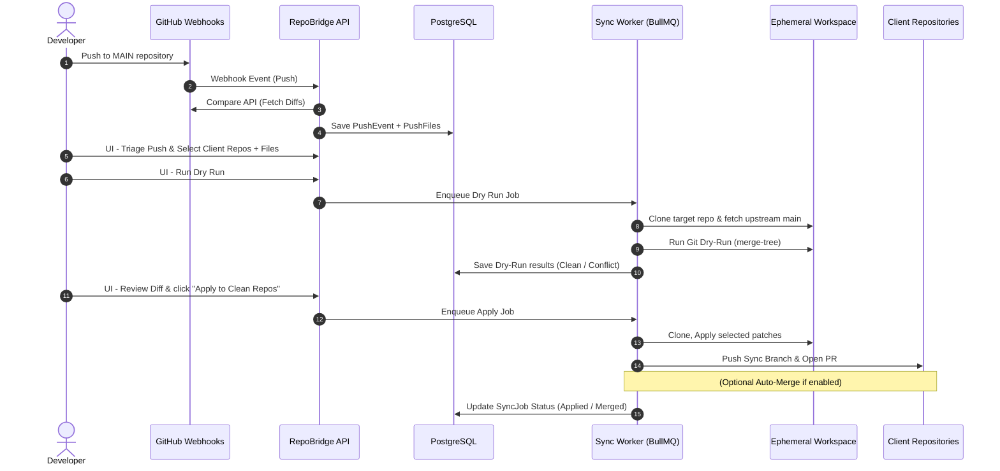

# 🌉 RepoBridge

[](https://nodejs.org/)
[](https://www.typescriptlang.org/)
[](https://react.dev/)

**RepoBridge** is a UI-first, developer-centric synchronization platform for GitHub repositories. It monitors an upstream "MAIN" repository and enables developers to selectively propagate individual file changes and commits to one or more "CLIENT" repositories. 

> [!TIP]
> **UI-driven Configuration:** Both user authentication (GitHub OAuth) and repository sync operations (GitHub App configuration) are configured and managed dynamically through the in-app Admin Settings dashboard (`/dashboard/settings`), keeping secrets secure and encrypted in the database.

Before applying changes, RepoBridge performs a high-fidelity **dry-run** simulation using 3-way git merges. Clean changes can be pushed automatically as Pull Requests with optional auto-merging, while conflicts are caught early and displayed inline with detailed conflict hunks for developer triage.

---

## 🗺️ System Workflow & Architecture



---

## ⚡ Key Features

- **Selective Syncing:** Granular file-level and directory-level selection. Choose exactly what gets applied to each downstream client.
- **Visual Conflict Resolver:** Visualizes code divergences, showing exact hunks and conflicts directly in the UI.
- **One-Click Apply & Auto-Merge:** Packages clean runs into a branch, pushes it, opens a Pull Request on the target repository, and optionally auto-merges to skip manual approval for boilerplate updates.
- **GitHub App & OAuth Security:** Seamless GitHub authentication, token generation, and secure webhook validation. Administrative credentials and GitHub App secrets are fully encrypted at rest using AES-256-GCM.
- **Audit Trails & Sync History:** Retains a chronological audit history of all pushes, sync jobs, file selections, and linked PR URLs.

---

## 🏗️ Project Architecture

The codebase is organized as a Node.js monorepo utilizing npm workspaces:

```text
repo-bridge/
├── package.json               # Root monorepo configuration & scripts
├── tsconfig.base.json         # Shared base compiler options
├── apps/
│   ├── api/                   # Express API Backend (TypeScript, Zod validation, Port 3001)
│   ├── web/                   # React 18 + Vite Frontend (Tailwind CSS, TanStack Query, Port 5173/5174)
│   └── worker/                # BullMQ Background Worker (processes git operations and dry-runs)
└── packages/
    ├── db/                    # Prisma Database client and schemas (PostgreSQL)
    └── shared/                # Common TypeScript interfaces & API contract contracts
```

---

## 🚀 Getting Started

### Prerequisites

- **Node.js**: `v20.0.0` or higher
- **PostgreSQL**: Local or managed instance
- **Redis**: For the BullMQ backend worker
- **Git**: Installed and accessible in the system environment (version `2.38+` required)

### Setup & Installation

1. **Clone the repository:**
   ```bash
   git clone https://github.com/digidoers/repo-bridge.git
   cd repo-bridge
   ```

2. **Install dependencies:**
   ```bash
   npm install
   ```

3. **Configure Environment Variables:**
   Copy the `.env.example` file to `.env`:
   ```bash
   cp .env.example .env
   ```
   Open the `.env` file and fill in your database, Redis, JWT secret, and encryption key credentials.

   > [!IMPORTANT]
   > **Do not** put your GitHub App ID, Private Key, Webhook Secret, or OAuth Client Secret in the `.env` file. RepoBridge includes a built-in admin dashboard where you configure these keys dynamically. They are stored securely and encrypted in the database, allowing you to manage and update your integrations directly from the web interface without restarting the servers.


4. **Initialize the Database:**
   Generate the database client and push the schema:
   ```bash
   npm run db:generate
   npm run db:push
   ```

5. **Start the Platform:**
   Start all frontend, API, and worker services concurrently using a single command:
   ```bash
   npm run dev
   ```

6. **Create an Account:**
   Navigate to the registration/signup page on your local server. **Make sure to register with the same email address used by your GitHub account** to ensure a clean association when linking your GitHub profile via OAuth later.


---

## 🛠️ GitHub Integration Setup

For RepoBridge to interact with GitHub, you must create a GitHub OAuth application and a GitHub App.

### 1. Register GitHub OAuth App (User Logins)
1. Go to your **GitHub Settings** -> **Developer Settings** -> **OAuth Apps** -> **New OAuth App**.
2. Configure the following:
   - **Application Name**: `RepoBridge`
   - **Homepage URL**: `http://localhost:5173` (or your production frontend URL)
   - **Authorization callback URL**: `http://localhost:3001/auth/github/callback` (or your production API callback endpoint)
3. Register the application, and note the **Client ID** and **Client Secret**.

### 2. Register GitHub App (Repository Operations)
1. Go to your **GitHub Settings** -> **Developer Settings** -> **GitHub Apps** -> **New GitHub App**.
2. Configure the following:
   - **GitHub App name**: `RepoBridge`
   - **Homepage URL**: `http://localhost:5173`
   - **Webhook**: Enable.
   - **Webhook URL**: `https://<your-tunnel-domain>/webhooks/github` (Note: for local dev, run a tunnel like ngrok/cloudflared pointing to `http://localhost:3001`)
   - **Webhook secret**: Create a secure random string.
3. Under **Repository Permissions**:
   - **Contents**: `Read & write`
   - **Pull requests**: `Read & write`
   - **Metadata**: `Read-only`
4. Under **Subscribe to events**:
   - Check the **Push** event.
5. Create the app. Save your **App ID**, **App Slug**, and **Webhook Secret**.
6. Generate a **Private Key** under the app's settings page, download the `.pem` file, and save its complete text contents.
7. Install the GitHub App on your GitHub account or organization and select the target repositories you want RepoBridge to access.

### 3. Save Configuration in RepoBridge
Once the server is running, log into RepoBridge, navigate to **Settings -> Admin Setup**, and paste the values to persist them securely.

---

## 🤝 Contributing

We welcome contributions of all sizes! Here is how you can help:

1. **Fork the Repo**: Create your own copy of the repository.
2. **Create a Feature Branch**: `git checkout -b feature/my-new-feature`
3. **Make and Lint Changes**: Ensure your code fits the project's styling and structure.
4. **Submit a Pull Request**: Push your branch to GitHub and open a PR with a description of your work.

For major architectural proposals, please open an issue first to discuss the implementation ideas.

